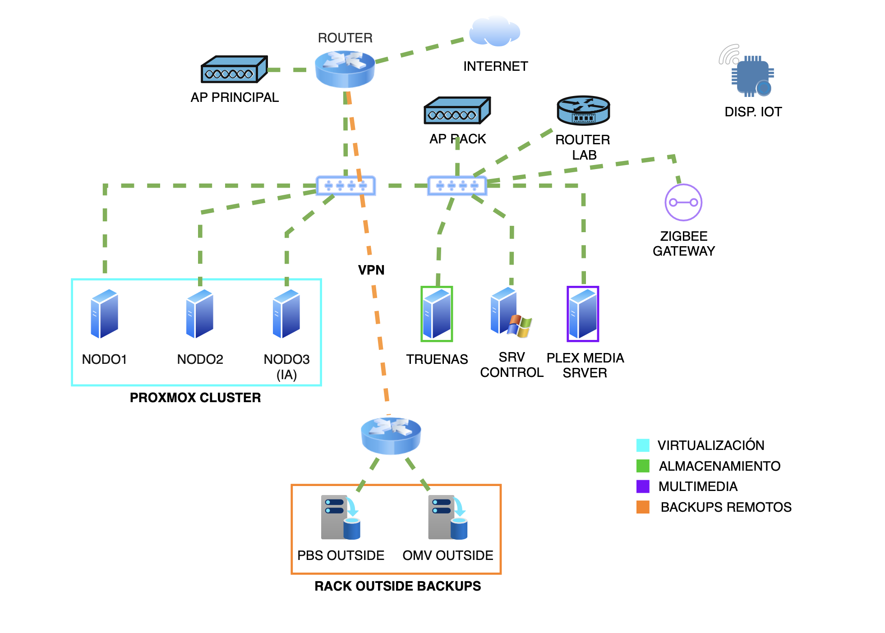

# 🏠 Homelab: Infraestructura y Servicios

> Infraestructura personal basada en virtualización, almacenamiento, copias de seguridad y servicios autoalojados.

**Tecnologías principales:** Proxmox VE · Linux · TrueNAS · PBS · WireGuard · Tailscale · Nextcloud · Ollama

---

## 🗺️ Diagrama de infraestructura

---

## 📋 Resumen

Este entorno se utiliza para aprendizaje continuo, administración de sistemas y pruebas de nuevas tecnologías.

La infraestructura está compuesta por:

- Clúster Proxmox de 3 nodos.
- Nodo dedicado a IA local.
- Servidor de almacenamiento basado en TrueNAS.
- Servidor remoto Proxmox Backup Server.
- Servidor OpenMediaVault remoto para copias de seguridad Windows.
- Servicios accesibles de forma segura mediante VPN.

---

## 🖥️ Infraestructura

### Virtualización

- Proxmox VE
- Contenedores LXC
- Máquinas virtuales

### Almacenamiento

- TrueNAS
- RAID 1
- Almacenamiento compartido
- Caché SSD

### Copias de seguridad

- Proxmox Backup Server remoto
- OpenMediaVault remoto
- Backups de máquinas virtuales
- Backups de contenedores
- Backups de equipos Windows

---

## 🤖 Inteligencia Artificial

- Ollama
- Open WebUI
- Nodo dedicado para IA local

---

## 🌐 Redes y acceso remoto

- WireGuard
- Tailscale
- Nginx Proxy Manager
- FTP

---

## 🚀 Servicios desplegados

### Productividad

- Nextcloud
- Vaultwarden
- Immich

### Multimedia

- Plex Media Server

### Domótica

- Home Assistant

### Monitorización

- Uptime Kuma
- NUT (monitorización SAI)

### DNS y filtrado

- Pi-hole
- AdGuard Home

### Administración remota

- Apache Guacamole

### Utilidades

- Conversor de archivos
- Descargador multimedia

---

## 🛠️ Tecnologías utilizadas

- Linux
- Proxmox VE
- LXC
- Virtualización
- TrueNAS
- VPN
- DNS
- DHCP
- Backup & Recovery
- Monitorización
- Servicios autoalojados

---

## 📊 Estado actual

Infraestructura operativa y utilizada diariamente para servicios de productividad, almacenamiento, multimedia, domótica, monitorización, acceso remoto e inteligencia artificial local.

## 📌 Datos principales

- 3 nodos Proxmox
- 1 nodo dedicado a IA local
- 2 servidores dedicados (TrueNAS y Plex)
- PBS remoto
- OMV remoto
- Múltiples servicios autoalojados en producción
